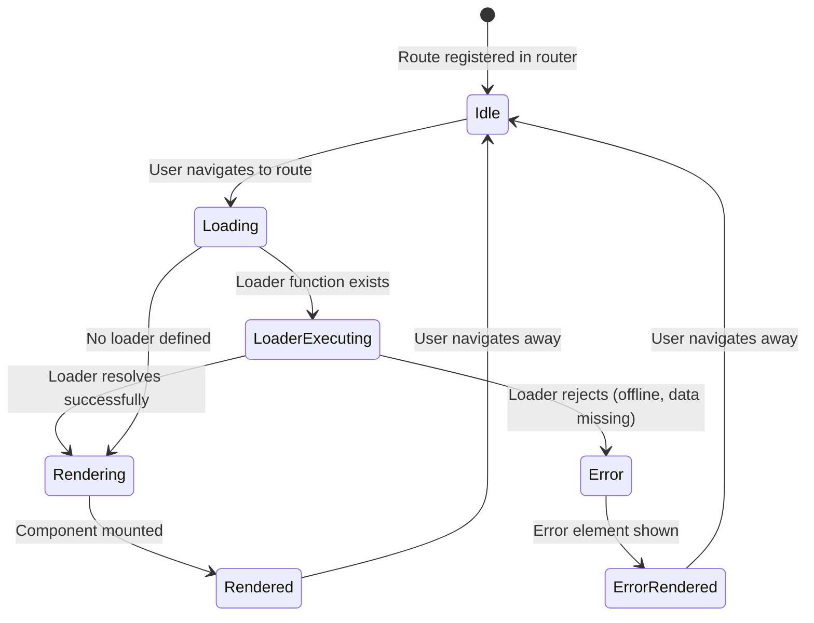
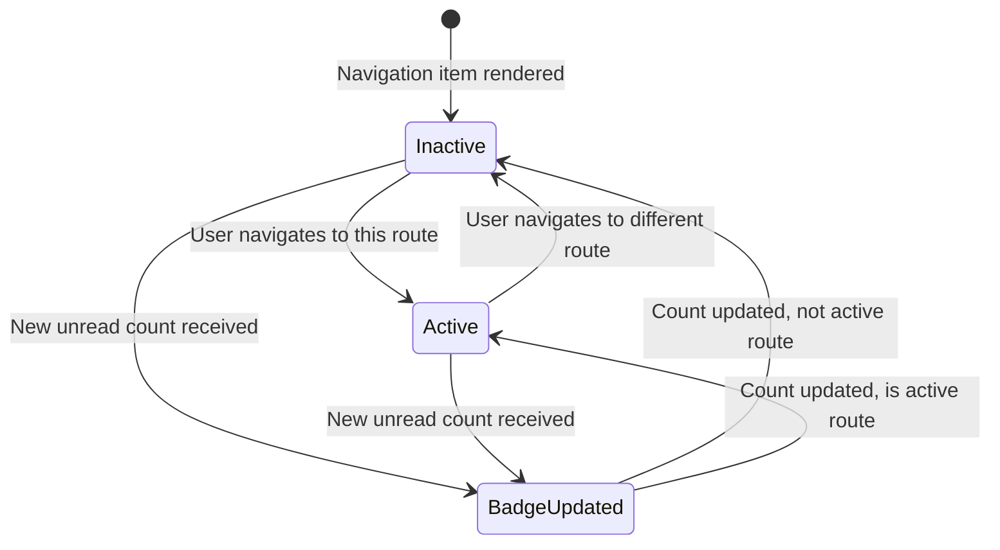
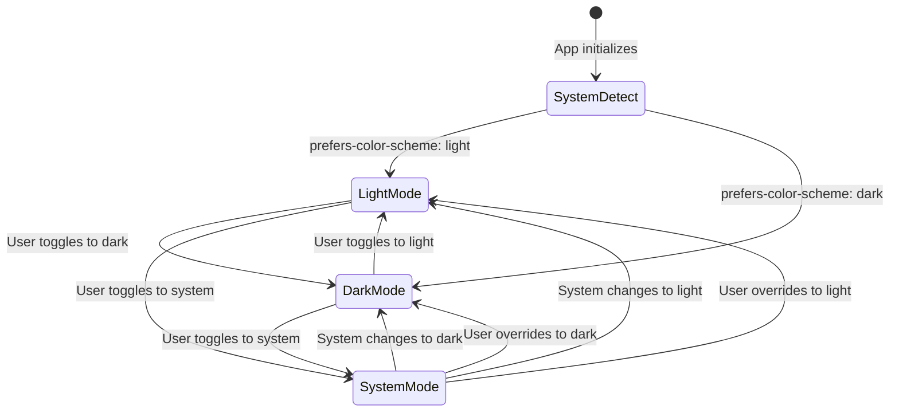
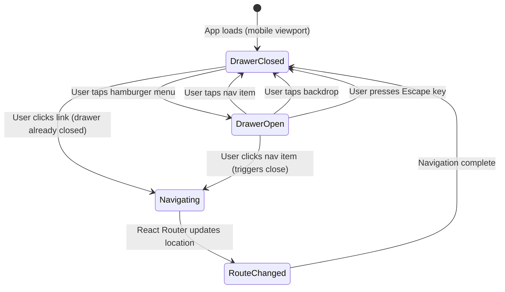
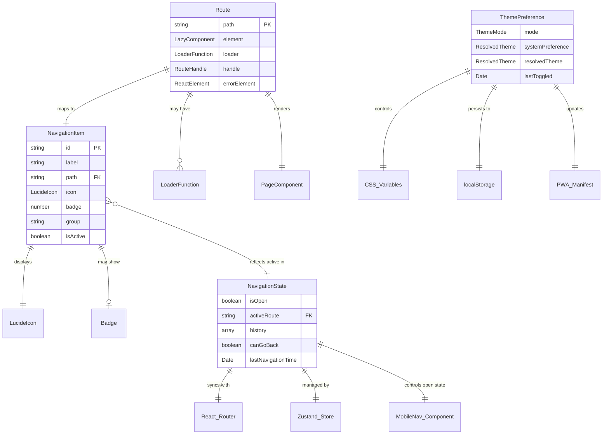
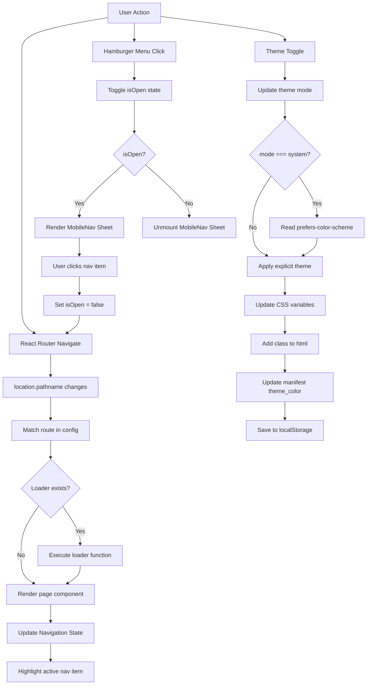

# Data Model: Replace Global Components with Shadcn UI

**Feature**: Replace Global Components with Shadcn UI  
**Date**: 2026-02-05  
**Phase**: 1 (Design & Contracts)  
**Status**: Complete

This document defines the core data entities for routing, navigation, and theming in the RSS Reader application after Shadcn UI and React Router integration.

---

## Entity 1: Route

**Purpose**: Represents a client-side navigation route in the React Router configuration. Each route maps a URL path to a React component and optional data loader.

### Attributes

| Attribute | Type | Required | Description | Example |
|-----------|------|----------|-------------|---------|
| `path` | `string` | Yes | URL path pattern (React Router syntax) | `"/feeds/:feedId"` |
| `element` | `React.LazyExoticComponent` | Yes | React component to render for this route | `lazy(() => import('@pages/FeedDetailPage'))` |
| `loader` | `LoaderFunction \| undefined` | No | Async function to load data before rendering | `loadFeedDetail` |
| `handle` | `RouteHandle \| undefined` | No | Metadata object for route configuration | `{ title: "Feed Detail", icon: "newspaper" }` |
| `errorElement` | `React.ReactElement \| undefined` | No | Component to render if route errors | `<ErrorBoundary />` |
| `index` | `boolean \| undefined` | No | Whether this route is an index route | `true` for `/` redirect |

### Relationships

- **Parent-Child**: Routes can have nested child routes (e.g., `/feeds` parent, `/feeds/:id` child)
- **Component Reference**: Each route references a page component (e.g., `FeedsPage`, `SettingsPage`)
- **Loader Reference**: Loaders reference storage layer (`@lib/storage`) for data fetching
- **Navigation Items**: Routes map 1:1 to navigation items (visible routes have `showInNav: true` in handle)

### Validation Rules

1. **Path Syntax**: Must follow React Router v6 path pattern syntax (`:param` for params, `*` for catch-all)
2. **Path Uniqueness**: No two routes can have identical paths at the same nesting level
3. **Loader Return Type**: If loader exists, must return serializable JSON data (no functions, classes, or circular references)
4. **Handle Structure**: If handle exists, must conform to `RouteHandle` interface:
   ```typescript
   interface RouteHandle {
     title: string;        // Page title for document.title
     icon?: string;        // Lucide icon name (optional)
     showInNav?: boolean;  // Whether route appears in navigation (default: false)
   }
   ```

### State Transitions



**Transition Details**:
1. **Idle → Loading**: User clicks navigation link, browser back/forward, or direct URL entry
2. **Loading → LoaderExecuting**: React Router invokes loader function; shows loading spinner
3. **LoaderExecuting → Rendering**: Loader resolves with data; data available via `useLoaderData()` hook
4. **LoaderExecuting → Error**: Loader rejects (network error, IndexedDB error, invalid ID); error element renders
5. **Loading → Rendering**: No loader; component renders immediately with Suspense fallback
6. **Rendering → Rendered**: Component `useEffect` runs; page title updated; analytics logged
7. **Rendered → Idle**: User initiates navigation; cleanup functions run; component unmounts

### Storage Persistence

Routes themselves are not persisted (statically defined in code). However:
- **Current Route**: React Router persists current URL in browser history API
- **Route History**: Browser maintains back/forward stack (managed by React Router)
- **Route Data**: Loader data is cached by React Router (cache key = route path + params)

---

## Entity 2: Navigation Item

**Purpose**: Represents a clickable item in the navigation menu (both mobile and desktop). Navigation items map directly to routes but add presentation metadata.

### Attributes

| Attribute | Type | Required | Description | Example |
|-----------|------|----------|-------------|---------|
| `id` | `string` | Yes | Unique identifier for the navigation item | `"nav-feeds"` |
| `label` | `string` | Yes | Display text for the navigation item | `"Feeds"` |
| `path` | `string` | Yes | Route path (matches Route.path) | `"/feeds"` |
| `icon` | `LucideIcon` | Yes | Lucide React icon component | `Rss` (from `lucide-react`) |
| `badge` | `number \| undefined` | No | Numeric badge count (e.g., unread articles) | `5` |
| `group` | `'main' \| 'user' \| undefined` | No | Visual grouping in navigation menu | `"main"` |
| `isActive` | `boolean` (computed) | Yes | Whether this item is the current active route | `true` if `location.pathname === path` |
| `order` | `number` | No | Sort order in navigation menu | `1` (Feeds), `2` (Favorites), etc. |

### Relationships

- **Route Mapping**: Each navigation item corresponds to exactly one Route
- **Icon Dependency**: Icons are imported from `lucide-react` library
- **Badge Data**: Badge count computed from Zustand store (e.g., `useStore(state => state.unreadCount)`)
- **Active State**: Computed from React Router's `useLocation()` hook

### Validation Rules

1. **Path Validation**: `path` must match an existing route definition
2. **Icon Validation**: `icon` must be a valid exported icon from `lucide-react` (e.g., `Rss`, `Star`, `Clock`, `Settings`)
3. **Badge Range**: If badge is provided, must be non-negative integer (0-999; values >999 shown as "999+")
4. **Label Length**: Label should be 3-20 characters for mobile display constraints
5. **Group Validation**: If group is provided, must be `'main'` or `'user'`

### State Transitions



**Transition Details**:
1. **Inactive → Active**: React Router navigation updates `location.pathname`; item's `isActive` becomes `true`; CSS applies active styles (background color, bold text)
2. **Active → Inactive**: User navigates away; `isActive` becomes `false`; active styles removed
3. **Inactive/Active → BadgeUpdated**: Zustand store updates `unreadCount`; badge prop updates; component re-renders with new badge value
4. **BadgeUpdated → Inactive/Active**: Badge update complete; item remains in same active/inactive state

### Example Data

```typescript
const navigationItems: NavigationItem[] = [
  {
    id: 'nav-feeds',
    label: 'Feeds',
    path: '/feeds',
    icon: Rss,
    badge: undefined,
    group: 'main',
    order: 1,
  },
  {
    id: 'nav-favorites',
    label: 'Favorites',
    path: '/favorites',
    icon: Star,
    badge: 3, // 3 unread favorites
    group: 'main',
    order: 2,
  },
  {
    id: 'nav-history',
    label: 'History',
    path: '/history',
    icon: Clock,
    badge: undefined,
    group: 'main',
    order: 3,
  },
  {
    id: 'nav-settings',
    label: 'Settings',
    path: '/settings',
    icon: Settings,
    badge: undefined,
    group: 'user',
    order: 4,
  },
];
```

---

## Entity 3: Theme Preference

**Purpose**: Represents the user's theme preference (light/dark/system) and the computed effective theme applied to the UI.

### Attributes

| Attribute | Type | Required | Description | Example |
|-----------|------|----------|-------------|---------|
| `mode` | `'light' \| 'dark' \| 'system'` | Yes | User's explicit theme preference | `"dark"` |
| `systemPreference` | `'light' \| 'dark'` (computed) | Yes | System theme from `prefers-color-scheme` media query | `"dark"` |
| `resolvedTheme` | `'light' \| 'dark'` (computed) | Yes | Effective theme applied to UI (mode if not system, else systemPreference) | `"dark"` |
| `lastToggled` | `Date \| undefined` | No | Timestamp of last manual theme toggle | `2026-02-05T10:30:00Z` |

### Relationships

- **CSS Variables**: `resolvedTheme` determines which CSS custom properties are applied to `<html>` element
- **Tailwind Class**: `resolvedTheme` value added as class to `<html>` (e.g., `<html class="dark">`)
- **localStorage**: `mode` value persisted to `localStorage.theme` for cross-session persistence
- **PWA Manifest**: `resolvedTheme` determines `theme_color` in manifest (light = `#ffffff`, dark = `#1a1a1a`)
- **Shadcn Components**: All Shadcn components automatically adapt to `resolvedTheme` via CSS variables

### Validation Rules

1. **Mode Values**: `mode` must be one of `'light'`, `'dark'`, or `'system'` (no other values allowed)
2. **Resolved Theme**: `resolvedTheme` is always `'light'` or `'dark'` (never `'system'`)
3. **System Preference**: `systemPreference` must match browser's `prefers-color-scheme` media query result
4. **Persistence**: `mode` must be persisted to `localStorage` on every change

### State Transitions



**Transition Details**:

1. **[*] → SystemDetect**: 
   - App loads; inline script in `index.html` checks `localStorage.theme`
   - If no stored preference, defaults to `'system'`
   - Media query `prefers-color-scheme` checked to determine initial `systemPreference`

2. **SystemDetect → LightMode / DarkMode**:
   - If `mode === 'system'`, resolve to `systemPreference`
   - If `mode === 'light'` or `'dark'`, use explicit mode
   - Apply resolved theme to `<html>` class and CSS variables

3. **LightMode ↔ DarkMode (Manual Toggle)**:
   - User clicks ThemeToggle dropdown
   - Selects opposite theme
   - `setTheme('dark')` or `setTheme('light')` called
   - `mode` updated; `resolvedTheme` updated; localStorage updated; CSS updated

4. **LightMode/DarkMode → SystemMode**:
   - User selects "System" in ThemeToggle dropdown
   - `setTheme('system')` called
   - `resolvedTheme` now computed from `systemPreference`
   - If system later changes (e.g., sunset triggers dark mode), `resolvedTheme` updates automatically

5. **SystemMode → LightMode / DarkMode (System Change)**:
   - Media query listener detects `prefers-color-scheme` change
   - `systemPreference` state updated
   - If `mode === 'system'`, `resolvedTheme` recomputes
   - CSS variables and `<html>` class updated
   - No localStorage change (user preference still `'system'`)

### Storage Persistence

**localStorage Schema**:
```typescript
// Key: "theme"
// Value: "light" | "dark" | "system"
localStorage.setItem('theme', 'dark');
```

**Initialization Flow**:
```typescript
// Inline script in index.html (prevents FOUC)
const theme = localStorage.getItem('theme') || 'system';
const systemTheme = window.matchMedia('(prefers-color-scheme: dark)').matches ? 'dark' : 'light';
const resolvedTheme = theme === 'system' ? systemTheme : theme;
document.documentElement.classList.add(resolvedTheme);
```

**React Provider Flow**:
```typescript
// ThemeProvider initializes from localStorage
const [mode, setMode] = useState<ThemeMode>(() => 
  (localStorage.getItem('theme') as ThemeMode) || 'system'
);

// Every mode change persists to localStorage
useEffect(() => {
  localStorage.setItem('theme', mode);
}, [mode]);
```

---

## Entity 4: Navigation State

**Purpose**: Represents the transient UI state of the navigation system (mobile drawer open/close, active route, navigation history).

### Attributes

| Attribute | Type | Required | Description | Example |
|-----------|------|----------|-------------|---------|
| `isOpen` | `boolean` | Yes | Whether mobile navigation drawer (Sheet) is open | `true` |
| `activeRoute` | `string` | Yes | Current route path from React Router | `"/feeds/abc123"` |
| `history` | `string[]` (computed) | Yes | Array of recently visited route paths (max 10) | `["/feeds", "/favorites", "/feeds/abc123"]` |
| `canGoBack` | `boolean` (computed) | Yes | Whether browser back button is available | `true` if `history.length > 1` |
| `lastNavigationTime` | `Date` | No | Timestamp of last navigation action | `2026-02-05T10:35:42Z` |

### Relationships

- **React Router**: `activeRoute` syncs with `useLocation().pathname`
- **Browser History**: `history` derived from browser history API (managed by React Router)
- **Zustand Store**: `isOpen` managed by Zustand for global state access
- **MobileNav Component**: `isOpen` controls Shadcn Sheet's `open` prop
- **Navigation Items**: `activeRoute` determines which NavigationItem has `isActive={true}`

### Validation Rules

1. **Active Route**: `activeRoute` must always match an existing route definition (or `"*"` for 404)
2. **History Length**: `history` array limited to 10 most recent routes (FIFO eviction)
3. **isOpen Scope**: `isOpen` only applies to mobile viewports (< 768px); always `false` on desktop
4. **Can Go Back**: `canGoBack` true only if `window.history.length > 1` (can't go back from initial page load)

### State Transitions



**Transition Details**:

1. **DrawerClosed → DrawerOpen**:
   - User taps hamburger icon (mobile only)
   - `setIsOpen(true)` called
   - Shadcn Sheet slides in from left
   - Backdrop appears; scroll locked on `<body>`

2. **DrawerOpen → DrawerClosed (Navigation)**:
   - User taps navigation item in drawer
   - `onNavigate(path)` called → triggers React Router navigation
   - `setIsOpen(false)` called in same event handler
   - Sheet slides out; backdrop fades; scroll unlocked

3. **DrawerOpen → DrawerClosed (Backdrop/Escape)**:
   - User taps backdrop or presses Escape key
   - Shadcn Sheet's `onOpenChange(false)` callback fires
   - `setIsOpen(false)` called
   - Sheet slides out; no navigation occurs

4. **DrawerClosed → Navigating**:
   - User clicks desktop navigation link OR clicks link in page content
   - React Router's `navigate()` function called
   - Loading state begins (optional loader executes)

5. **Navigating → RouteChanged**:
   - React Router updates `location.pathname`
   - Component for new route renders
   - `activeRoute` state updates to new path
   - `history` array updated (new path pushed; oldest path evicted if length > 10)
   - `document.title` updated from route's `handle.title`

### Example State

```typescript
// Initial state (app just loaded)
{
  isOpen: false,
  activeRoute: '/feeds',
  history: ['/feeds'],
  canGoBack: false,
  lastNavigationTime: new Date('2026-02-05T10:30:00Z'),
}

// After navigating to a feed
{
  isOpen: false,
  activeRoute: '/feeds/abc123',
  history: ['/feeds', '/feeds/abc123'],
  canGoBack: true,
  lastNavigationTime: new Date('2026-02-05T10:31:15Z'),
}

// After opening mobile menu
{
  isOpen: true,
  activeRoute: '/feeds/abc123',
  history: ['/feeds', '/feeds/abc123'],
  canGoBack: true,
  lastNavigationTime: new Date('2026-02-05T10:31:15Z'),
}

// After navigating from mobile menu
{
  isOpen: false,
  activeRoute: '/favorites',
  history: ['/feeds', '/feeds/abc123', '/favorites'],
  canGoBack: true,
  lastNavigationTime: new Date('2026-02-05T10:32:00Z'),
}
```

### Storage Persistence

**No Direct Persistence**: Navigation state is ephemeral (resets on page reload). However:
- **React Router**: Persists `activeRoute` via browser history API (URL in address bar)
- **Session Storage**: Could optionally persist `history` array to restore after refresh (future enhancement)
- **No localStorage**: `isOpen` never persisted (always closed on page load)

---

## Entity Relationships Diagram



---

## TypeScript Type Definitions

```typescript
// src/types/navigation.ts

import type { LucideIcon } from 'lucide-react';
import type { LoaderFunction, LazyRouteFunction } from 'react-router-dom';

/**
 * Route Handle Metadata
 * Attached to routes for title, icon, and navigation visibility
 */
export interface RouteHandle {
  title: string;
  icon?: string; // Lucide icon name (e.g., "rss", "star")
  showInNav?: boolean;
}

/**
 * Route Configuration
 * Extends React Router route object with typed handle
 */
export interface AppRoute {
  path: string;
  element: React.LazyExoticComponent<() => JSX.Element>;
  loader?: LoaderFunction;
  handle?: RouteHandle;
  errorElement?: React.ReactElement;
  index?: boolean;
  children?: AppRoute[];
}

/**
 * Navigation Item
 * Represents a clickable item in the navigation menu
 */
export interface NavigationItem {
  id: string;
  label: string;
  path: string;
  icon: LucideIcon;
  badge?: number;
  group?: 'main' | 'user';
  order?: number;
}

/**
 * Theme Mode
 * User's explicit theme preference
 */
export type ThemeMode = 'light' | 'dark' | 'system';

/**
 * Resolved Theme
 * Computed effective theme (never 'system')
 */
export type ResolvedTheme = 'light' | 'dark';

/**
 * Theme Preference
 * Complete theme state
 */
export interface ThemePreference {
  mode: ThemeMode;
  systemPreference: ResolvedTheme;
  resolvedTheme: ResolvedTheme;
  lastToggled?: Date;
}

/**
 * Navigation State
 * UI state for navigation system
 */
export interface NavigationState {
  isOpen: boolean;
  activeRoute: string;
  history: string[];
  canGoBack: boolean;
  lastNavigationTime?: Date;
}
```

---

## Data Flow Diagram



---

## Summary

This data model defines four core entities:

1. **Route**: Client-side navigation routes with loaders and metadata
2. **Navigation Item**: Clickable navigation menu items with icons and badges
3. **Theme Preference**: User theme settings and computed effective theme
4. **Navigation State**: Transient UI state for mobile drawer and active route

All entities include:
- Complete attribute definitions with types and validation rules
- State transition diagrams showing lifecycle events
- Storage persistence strategies
- TypeScript type definitions for type safety

**Next Step**: Use this data model to generate API contracts in `contracts/` directory (routes.yaml and navigation.ts).

---

**Document Version**: 1.0.0  
**Author**: Design Workflow  
**Last Updated**: 2026-02-05
